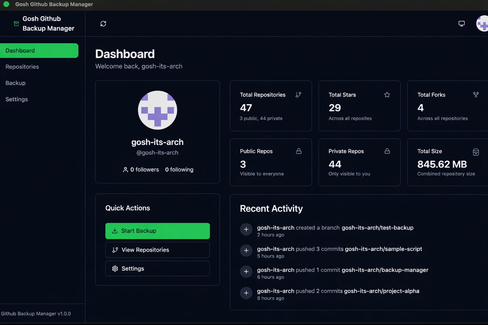
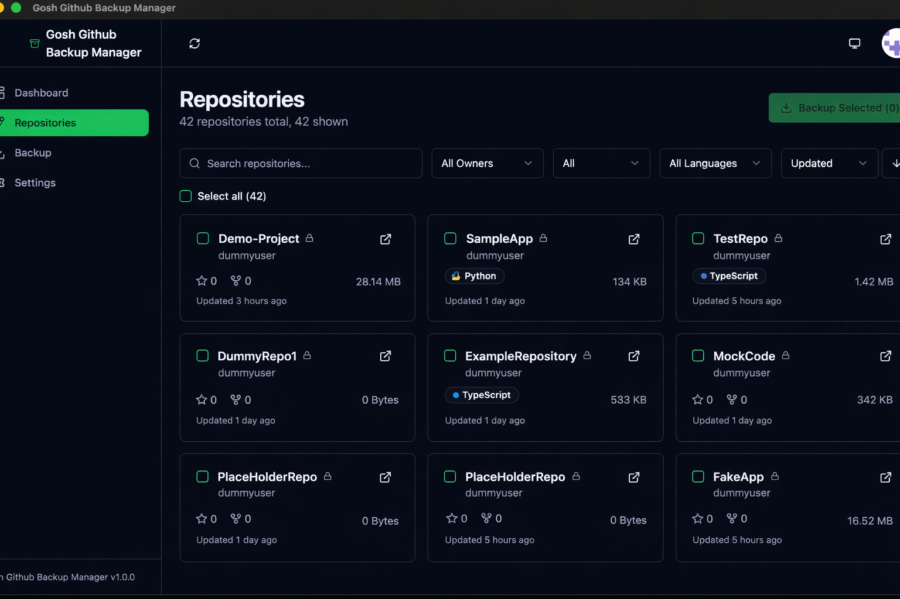
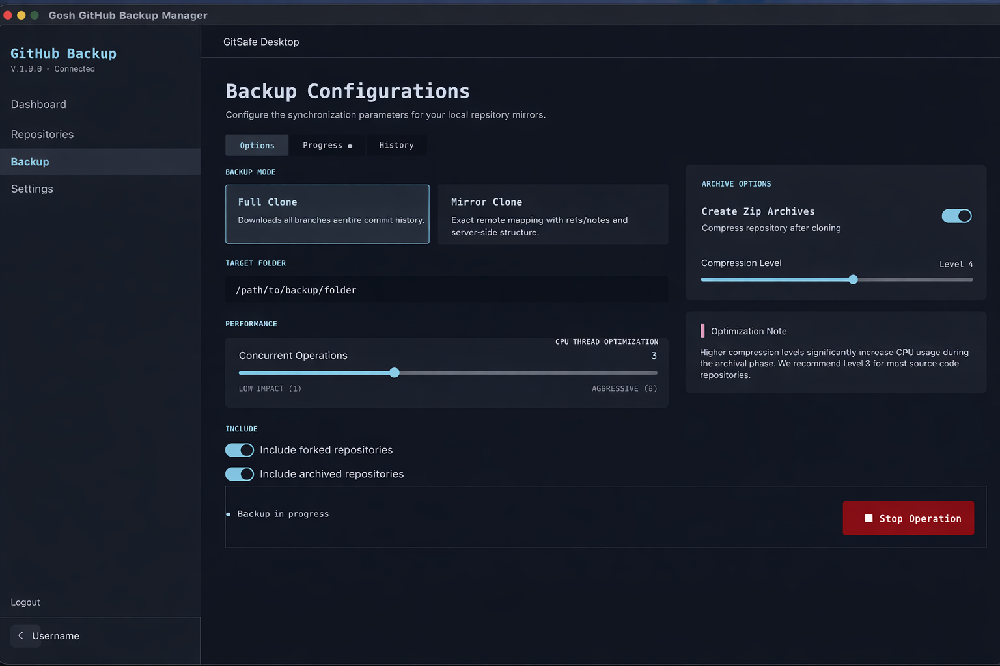
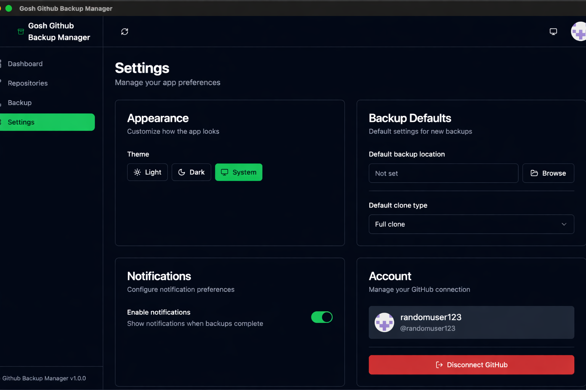
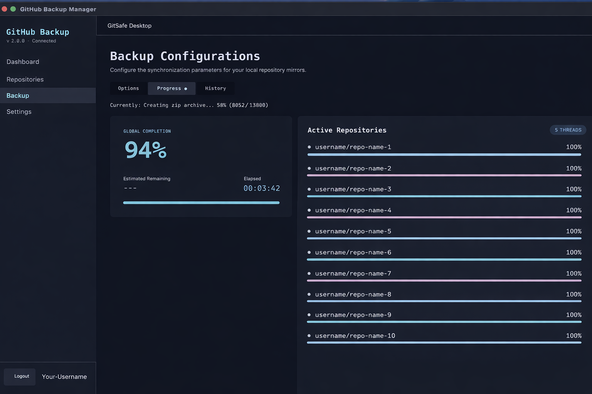

# Gosh GitHub Backup Manager

A native desktop app for backing up your GitHub repositories. Built with Rust and the [iced](https://github.com/iced-rs/iced) GUI framework — no Electron, no web runtime, just a fast binary that runs on macOS, Windows, and Linux.

Connect with your GitHub account, pick the repos you care about, and back them up locally with a couple of clicks. You can clone everything, mirror repos, archive them as zips, and keep a history of what you've backed up.

## Screenshots







## What it does

Connect via a Personal Access Token or GitHub's OAuth Device Flow. Once linked, you get a dashboard showing your repos, stars, and recent backup activity.

From the repository browser you can filter by language, visibility, or owner, then select which repos to back up. The backup screen lets you choose between a full clone or a mirror, set how many repos to clone in parallel, and optionally create a compressed zip archive when it's done. Progress is tracked in real-time with per-repo status.

Settings are persisted between sessions — including your theme preference (dark, light, or system).

## Installation

### From source

You'll need Rust (stable) and Git installed.

```bash
git clone https://github.com/goshitsarch-eng/Gosh-Github-Backup-Manager.git
cd Gosh-Github-Backup-Manager
cargo build --release
./target/release/gosh-github-backup-manager
```

On macOS you can create an app bundle with the icon:

```bash
./scripts/bundle-macos.sh
open "target/release/Gosh GitHub Backup Manager.app"
```

### Pre-built binaries

Check the [Releases](https://github.com/goshitsarch-eng/Gosh-Github-Backup-Manager/releases) page for downloads. Also available on the [AUR](https://aur.archlinux.org/packages/gosh-github-backup-manager-bin) for Arch Linux users.

## GitHub token scopes

The app needs a token with `repo`, `read:user`, and `read:org` scopes. You can create one at [github.com/settings/tokens/new](https://github.com/settings/tokens/new) — or just use the OAuth sign-in flow and skip the token entirely.

## Data storage

Your token, settings, and backup history are stored in a single JSON file:

| Platform | Path |
|----------|------|
| macOS | `~/Library/Application Support/gosh-github-backup-manager/` |
| Linux | `~/.local/share/gosh-github-backup-manager/` |
| Windows | `%APPDATA%\gosh-github-backup-manager\` |

On Unix systems the file permissions are set to `0600` (owner-only).

## Known limitations

- **Token storage** is plain text JSON, not a system keychain
- **Scheduled backups** are not yet implemented (the settings exist but don't do anything)
- If a repo already exists at the destination, the app fetches updates rather than re-cloning

## License

AGPL-3.0

---

*This project is independent and not affiliated with GitHub, Inc.*
